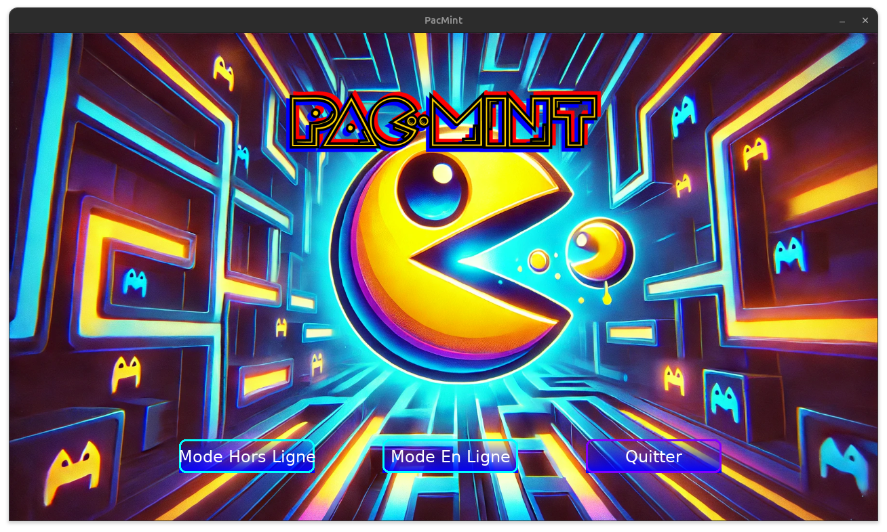
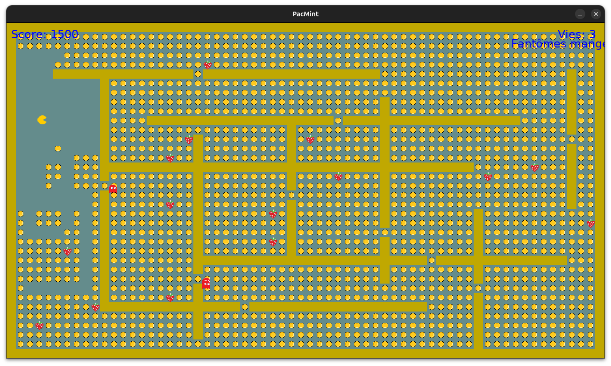
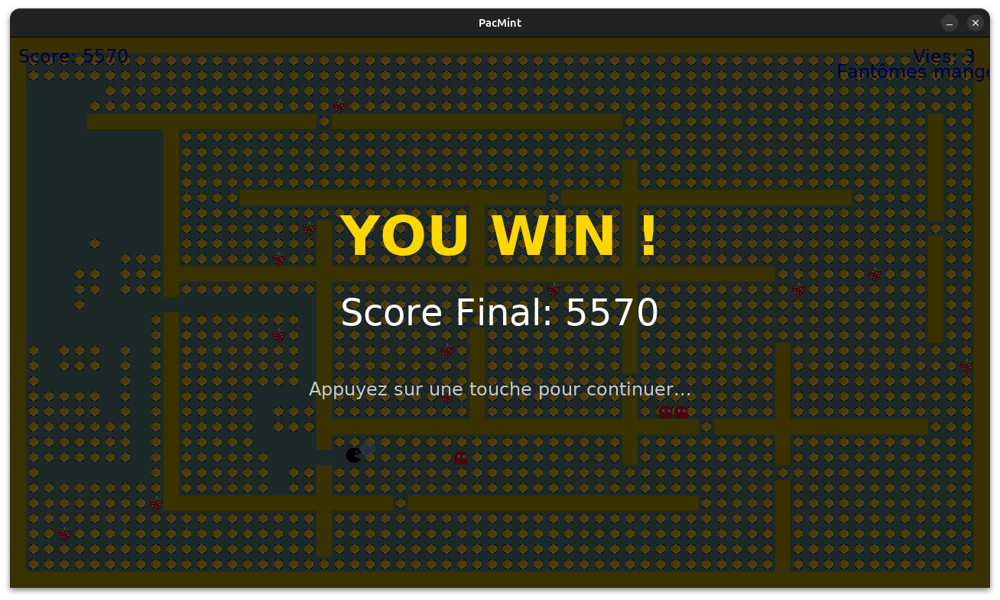

# PacmINT

PacmINT is a multiplayer remake of Pac-Man that combines a Pygame client, a real-time TCP game server, and a Django web portal. The client lets players run local or online matches, the server keeps rooms in sync (movement, collision, chat), and the Django site manages accounts, leaderboards, and lobby admin. It is aimed at students, hobbyists, and developers who want a Python-based example of a full-stack networked game, as well as retro-game fans who want to host or customize multiplayer Pac-Man sessions.

## Screenshots
### Lobby


### Gameplay


### Victory 


## Deployment

To deploy this project (Linux)

### Configure X11

Authorize Docker to access x11 server
```bash
  xhost +local:docker
```
Check graphics devices: Make sure that /dev/dri exists:
```bash
  ls /dev/dri
```

If /dev/dri/card1 does not exist, check your graphics driver:
```bash
  glxinfo | grep "OpenGL renderer"
```

Install the appropriate drivers (for example, mesa-vulkan-drivers for Intel/AMD).

### Build and run the game
```bash
  docker-compose down
  docker-compose build
  docker-compose up -d
```
## Authors

- [@yannickzheng](https://www.github.com/yannickzheng)

